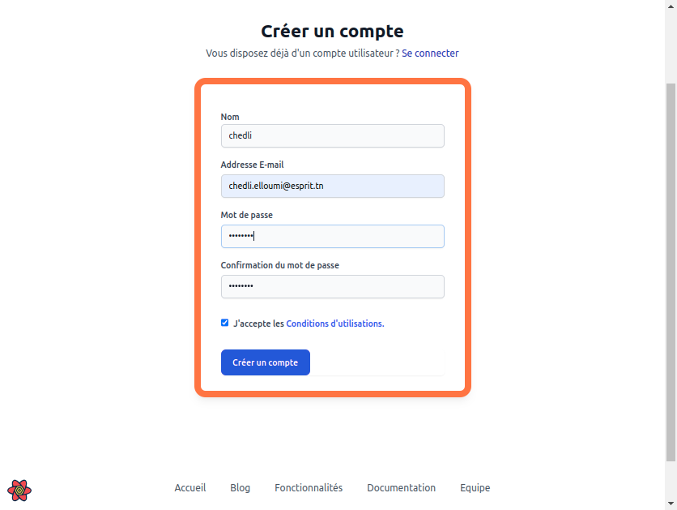

### make a language component explaining the language made with this project (usually french)
# What is GaïaMundi ?

An **open-source tool for scientific practice in the service of decision-making.**

GaïaMundi is an open-source tool whose primary purpose is to allow for **better structuring of the processes of observation and analysis of the needs of territories.**

To achieve this, the platform enables users to:

* **Build rational geographies** and analyze territorial transformations by confronting data and knowledge from stakeholders.
* **Reconcile data from heterogeneous sources** across different registers (economic, social, urban, environmental, educational, health).
* **Construct and share diagnostics and expertise**, which directly supports needs analysis approaches.
* Furthermore, it helps to disseminate **knowledge and understanding** about territories and their dynamics.
* Ultimately, the tool is used to **scenario-plan** analyzed situations and support the transition to action.

## GitHub Repository
::github{repo="Elchedli/Gaiamundi"}

## Project explanation

* when you enter the site you will greeted by a lot of pages that you can view and navigate with them

but to use the app you need to login or to register first
in case you don't have an account you should create one

::carousel

::

---

### 1. Data Input

* **GeoJSON Data** is the primary input source, which is fed directly into the **Geographic Map** component.

### 2. Map Enrichment (The "Add" Phase)

This central phase involves integrating additional data and calculations with the base Geographic Map:

* **Geographic Map** data can be combined with other data sources using the **Add** process (indicated by the large loop).
* **CSV files** are converted to JSON format (**JSON Conversion**) to make them compatible for integration.
* **Indicators** are created using a **Mathematical Equation**.
* The converted CSV data and the calculated Indicators are then brought together through a **Fusion** step.

### 3. Visualization Setup

* The fused data from the central loop is used to define the **Legends**. The Legends represent the categories or values that will be visually displayed on the map.

### 4. Output Customization

* The **Legends** are subject to a **Modification** step (highlighted in orange). This step allows a user to define how the map should look.
* This Modification ultimately determines the **Map Color**, which is the final visual output displayed on the Geographic Map.